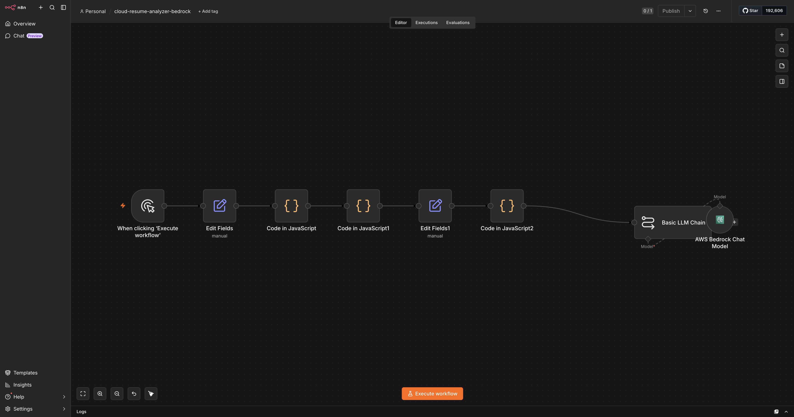
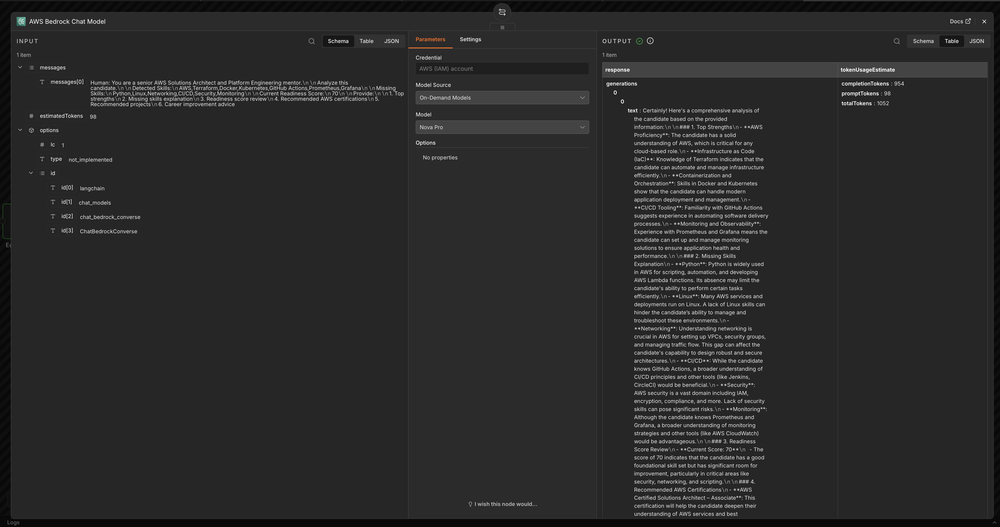
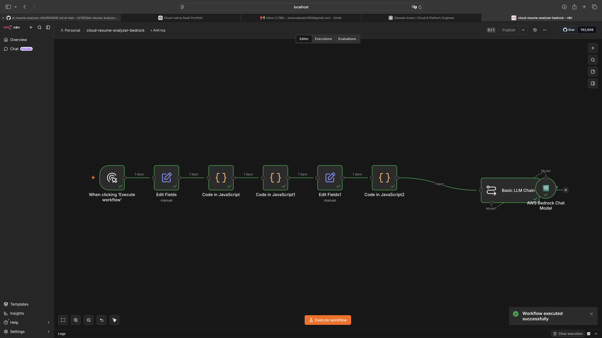
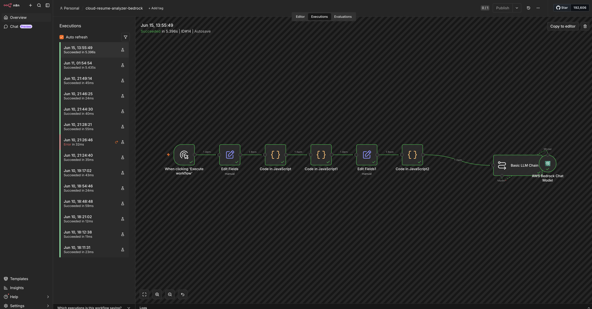

# AI Resume Analyzer with AWS Bedrock

## Overview

This project demonstrates an AI-powered resume analysis platform built using n8n, AWS Bedrock, and Amazon Nova Pro.

The workflow analyzes resume content, extracts technical skills, identifies skill gaps, calculates readiness scores, and generates AI-driven career recommendations for cloud and platform engineering roles.

## Features

* Resume skill extraction
* Skill gap analysis
* Readiness scoring
* AWS Bedrock integration
* Amazon Nova Pro AI analysis
* Certification recommendations
* Career improvement guidance
* Automated workflow execution

## Architecture

Resume Text

↓

Skill Extraction Engine

↓

Gap Analysis Engine

↓

Readiness Score Calculation

↓

AWS Bedrock (Amazon Nova Pro)

↓

AI Career Assessment

↓

Recommendations Report

## Technologies

* AWS Bedrock
* Amazon Nova Pro
* n8n
* JavaScript
* Docker
* GitHub

## Screenshots

### Workflow Architecture

The AI Resume Analyzer workflow processes candidate skills, performs custom scoring logic, and uses AWS Bedrock with Amazon Nova Pro to generate career recommendations.

---

### AWS Bedrock AI Analysis

AI-powered skills analysis generated using AWS Bedrock and Amazon Nova Pro.

---

### Custom Scoring Engine

Custom JavaScript logic calculates readiness scores and identifies skill gaps against target cloud and platform engineering roles.

---

### Workflow Execution

Successful workflow execution within n8n.

## Skills Demonstrated

* Generative AI
* Prompt Engineering
* Workflow Automation
* Low-Code Development
* JavaScript Automation
* Data Processing
* Cloud Engineering
* Platform Engineering

## Example Output

The workflow provides:

* Technical skill assessment
* Missing skill identification
* Readiness score out of 100
* Certification recommendations
* Project recommendations
* Personalized career development advice

## Future Enhancements

* PDF resume upload
* Multi-role career assessment
* Resume scoring dashboard
* Automated report generation
* Integration with AWS Lambda and S3
