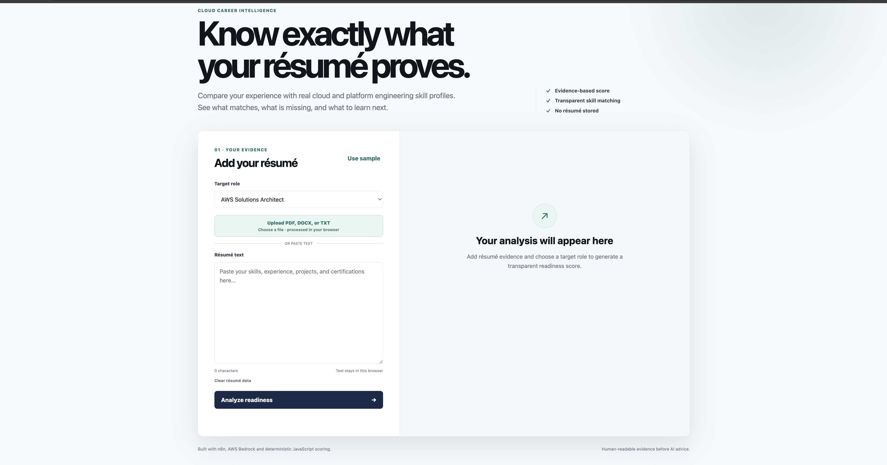

# AI Resume Analyzer with AWS Bedrock & n8n

An AI-assisted cloud career readiness platform combining a privacy-conscious browser frontend, deterministic skill scoring, workflow automation with n8n, and AWS Bedrock-powered career analysis.

## Overview

The AI Resume Analyzer evaluates résumé evidence against cloud and platform engineering role profiles.

The application can:

- Accept PDF, DOCX, TXT, or pasted résumé text
- Detect relevant technical skills
- Compare those skills against a selected target role
- Calculate a deterministic readiness score
- Identify missing skills
- Show the résumé evidence responsible for each detected skill
- Classify evidence as **mentioned**, **supported**, or **strong**
- Use AWS Bedrock through n8n for AI-assisted career analysis and recommendations

The project demonstrates practical implementation of:

- AI workflow automation
- AWS Bedrock integration
- Prompt engineering
- Deterministic business logic
- Browser-based document processing
- Explainable skill matching
- Docker-based local development
- Automated testing

> The evidence labels describe the strength of the written evidence found in a résumé. They are not hiring decisions and do not independently verify a candidate's experience.

---

## Application Preview



The frontend provides a simple interface for selecting a target cloud role and either uploading a résumé or pasting résumé text.

Résumé extraction and deterministic scoring happen in the browser.

---

## How It Works

The project has two complementary analysis paths.

### 1. Deterministic Browser Analysis

```text
Résumé
  │
  ├── PDF
  ├── DOCX
  ├── TXT
  └── Pasted text
       │
       ▼
Browser Extraction
       │
       ▼
Skill Detection
       │
       ▼
Role Profile Comparison
       │
       ├── Matched Skills
       ├── Missing Skills
       ├── Readiness Score
       └── Evidence Ledger
```

This path does not require AWS Bedrock.

### 2. AI-Assisted n8n Workflow

```text
Résumé Data
    │
    ▼
n8n Workflow
    │
    ▼
Skill Extraction
    │
    ▼
Custom JavaScript Processing
    │
    ▼
Readiness Score
    │
    ▼
AWS Bedrock
Amazon Nova Pro
    │
    ▼
AI Skills Analysis
    │
    ▼
Career Recommendations
```

AWS Bedrock extends the deterministic analysis with generative AI-based assessment and career guidance.

---

## Key Features

### Resume Input

- PDF résumé upload
- DOCX résumé upload
- TXT résumé upload
- Pasted résumé text
- Browser-based document extraction
- Clear/reset controls

### Deterministic Skill Analysis

- Case-insensitive skill detection
- Common technology alias normalization
- Role-specific skill profiles
- Transparent readiness scoring
- Matched skill identification
- Missing skill identification

### Evidence Ledger

Every detected skill can be linked back to résumé evidence.

Evidence is classified as:

- **Mentioned** — the technology or skill appears in the résumé
- **Supported** — the résumé associates the skill with an action or implementation
- **Strong** — the résumé contains stronger evidence such as action plus measurable outcome

This makes the scoring process easier to inspect instead of presenting users with an unexplained score.

### AI Analysis

The n8n workflow integrates with:

- AWS Bedrock
- Amazon Nova Pro
- Custom prompt engineering
- Career recommendation generation

The AI layer can generate:

- Skills assessments
- Gap analysis
- Strength analysis
- Career development recommendations
- Certification guidance

---

## Supported Role Profiles

The scoring engine is designed around cloud and platform engineering career paths.

Example skills include:

- AWS
- Terraform
- Docker
- Kubernetes
- Python
- Linux
- Networking
- CI/CD
- Security
- Monitoring

The frontend includes target-role selection so the same résumé can be evaluated against different role expectations.

---

## Skill Normalization

The scoring engine normalizes common aliases before calculating results.

Examples:

```text
K8s / EKS
    ↓
Kubernetes

GitHub Actions / Jenkins
    ↓
CI/CD

Prometheus / Grafana / CloudWatch
    ↓
Monitoring
```

This prevents simple terminology differences from incorrectly appearing as skill gaps.

---

## Privacy Model

The browser frontend was intentionally designed so résumé processing can happen locally.

For the deterministic frontend:

- Résumé text is extracted in the browser
- Skill detection runs in the browser
- Readiness scoring runs in the browser
- Résumé text is not intentionally persisted by the application
- AWS credentials are never exposed to the browser

PDF.js and Mammoth are used for browser-side document extraction.

The first PDF or DOCX use requires internet access because those browser libraries are loaded from pinned public CDN URLs.

---

## AWS Bedrock Integration

AWS Bedrock is used through the separate n8n workflow.

The public workflow export does **not** contain:

- AWS access keys
- Reusable AWS credential bindings
- Private n8n instance credentials
- n8n instance fingerprints

After importing the workflow, users must attach their own AWS credential to the **AWS Bedrock Chat Model** node.

An AWS account with access to the configured Bedrock model is required for the AI-powered workflow.

---

## Technology Stack

### AI & Automation

- n8n
- AWS Bedrock
- Amazon Nova Pro
- Prompt Engineering

### Frontend

- HTML
- CSS
- JavaScript
- PDF.js
- Mammoth.js

### Cloud

- AWS
- AWS IAM
- AWS Bedrock

### Development & Operations

- Docker
- Docker Compose
- Node.js test runner
- JSON

---

## Quick Start

### Requirements

For the deterministic frontend:

- Docker
- Docker Compose
- Modern web browser

For the full AI workflow:

- AWS account
- Amazon Bedrock model access
- IAM principal allowed to invoke the selected Bedrock model

### 1. Clone the repository

```bash
git clone https://github.com/AZ1600/ai-resume-analyzer-n8n.git
cd ai-resume-analyzer-n8n
```

### 2. Create the local environment file

```bash
cp .env.example .env
```

### 3. Start the services

```bash
docker compose up -d
```

### 4. Open the frontend

Visit:

```text
http://localhost:3001
```

You can:

- Upload a PDF, DOCX, or TXT résumé
- Paste résumé text manually
- Select a target role
- Generate a readiness analysis
- Inspect the evidence behind matched skills

If port `3001` is already in use, configure `FRONTEND_PORT` in `.env`.

### 5. Open n8n

Visit:

```text
http://localhost:5678
```

Import:

```text
cloud-resume-analyzer-bedrock.json
```

Then attach your AWS credential to the **AWS Bedrock Chat Model** node.

---

## Running Without AWS Bedrock

The browser frontend can still be used when AWS Bedrock is unavailable.

The following features do not depend on Bedrock:

- Resume upload
- PDF/DOCX/TXT extraction
- Skill detection
- Role comparison
- Readiness scoring
- Skill gap identification
- Evidence ledger
- Evidence confidence labels

Bedrock is required only for the generative AI portion of the n8n workflow.

This separation allows the deterministic frontend to be deployed independently while the AI integration remains optional.

---

## Screenshots

### Resume Analysis Frontend

Browser-based résumé upload and career readiness interface.


---

### Workflow Architecture

The n8n workflow processes résumé information, applies custom scoring logic, and integrates with AWS Bedrock.


---

### AWS Bedrock AI Analysis

AI-assisted skills analysis generated using AWS Bedrock and Amazon Nova Pro.


---

### Custom Scoring Engine

Custom JavaScript logic calculates readiness scores and identifies skill gaps against target cloud and platform engineering roles.


---

### Workflow Execution

Successful workflow execution inside n8n.


---

## Repository Structure

```text
.
├── docs/
│   ├── ai-analysis.png
│   ├── resume-analyzer-frontend.png
│   ├── scoring-engine.png
│   ├── workflow-execution.png
│   └── workflow-overview.png
│
├── frontend/
│   ├── app.js
│   ├── Dockerfile
│   ├── file-extraction.js
│   ├── index.html
│   └── styles.css
│
├── lib/
│   └── resume-scoring.js
│
├── tests/
│   ├── frontend.test.js
│   ├── resume-scoring.test.js
│   └── workflow-template.test.js
│
├── .dockerignore
├── .env.example
├── .gitignore
├── cloud-resume-analyzer-bedrock.json
├── docker-compose.yml
├── package.json
└── README.md
```

---

## Testing

The project uses Node.js' built-in test runner.

Run:

```bash
npm test
```

The test suite covers areas including:

- Skill detection
- Capitalization handling
- Technology aliases
- Role matching
- Readiness scoring
- Evidence extraction
- Frontend behaviour
- Workflow template validation

---

## Docker

The project uses Docker Compose to run both the frontend and n8n locally.

To start everything:

```bash
docker compose up -d
```

To rebuild the frontend after changes:

```bash
docker compose build frontend
docker compose up -d frontend
```

To stop the environment:

```bash
docker compose down
```

---

## Local Development Security

The included Docker and n8n configuration is intended for local development.

If n8n is exposed publicly, additional controls should be configured, including:

- HTTPS
- Authentication
- Secure cookies
- Strong n8n encryption keys
- Correct `WEBHOOK_URL`
- Restricted network access
- Proper AWS IAM permissions

AWS credentials should never be committed to the repository.

---

## Design Principles

### Explainability

A readiness score should not be a black box.

The evidence ledger allows users to inspect why a skill was detected.

### Privacy

Resume analysis should avoid sending sensitive candidate information to unnecessary services.

The deterministic frontend therefore performs document extraction and scoring locally.

### Deterministic Before Generative

Structured scoring is performed using deterministic JavaScript logic.

Generative AI is used as an additional analysis layer rather than as the source of the readiness score.

### Portable AI Workflow

The n8n workflow is provided as a reusable template while keeping credentials outside version control.

---

## Skills Demonstrated

### AI Engineering

- Generative AI integration
- Prompt engineering
- LLM workflow design
- AI automation
- Explainable AI-assisted workflows

### Cloud Engineering

- AWS Bedrock
- AWS IAM
- Cloud service integration
- Credential separation

### Platform & DevOps Engineering

- Docker
- Docker Compose
- Workflow automation
- Internal tool development
- Reproducible local environments

### Software Engineering

- JavaScript
- Browser-side document processing
- Deterministic business logic
- Automated testing
- Data transformation

---

## Future Enhancements

Potential next steps include:

- Deploy the standalone frontend publicly
- Secure backend integration between the frontend and n8n
- Optional Bedrock-powered analysis from the web application
- Candidate dashboard
- Recruiter reporting
- Automated learning plans
- Interview preparation guidance
- Multi-model AI support
- Skills trend analytics
- Additional cloud and platform engineering role profiles
- CI/CD validation with GitHub Actions

---

## Project Status

The project currently supports a functional deterministic résumé-analysis frontend and an AWS Bedrock-powered n8n workflow.

The two components are intentionally decoupled so that the frontend can operate without active Bedrock access.

---

## Author

**Olawale Azeez**

Cloud Engineer | Platform Engineer | DevOps Engineer

Focused on cloud-native platforms, platform engineering, AI automation, Kubernetes, Infrastructure as Code, and AWS solutions architecture.

GitHub: https://github.com/AZ1600

LinkedIn: https://www.linkedin.com/in/olawale-azeez-40a891382/